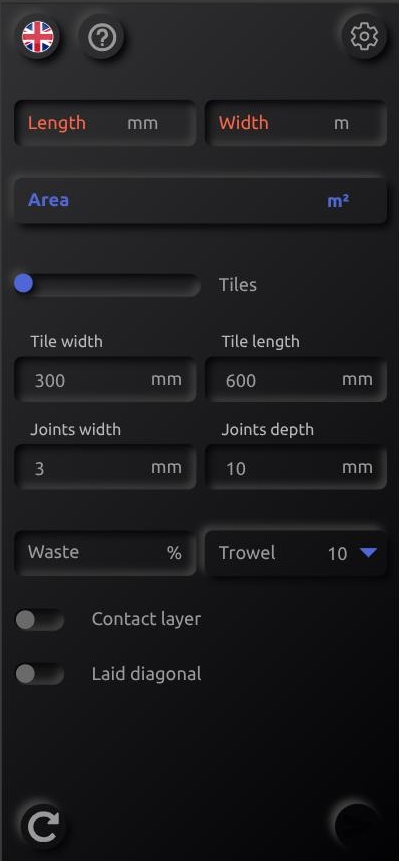
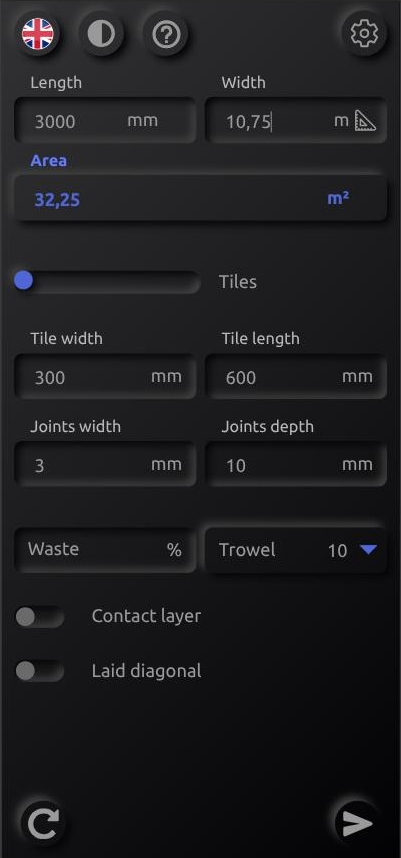
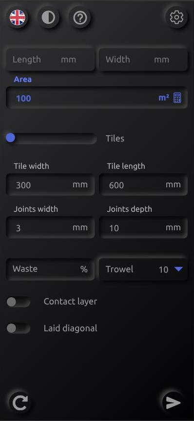
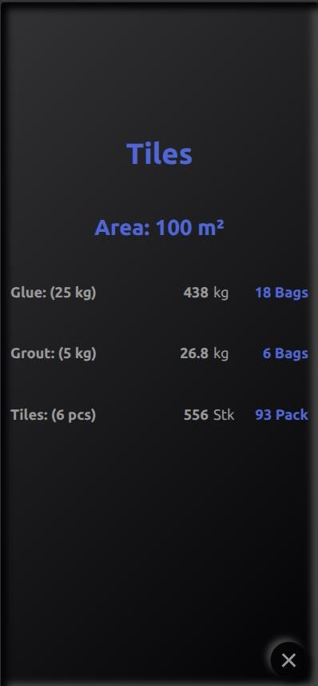
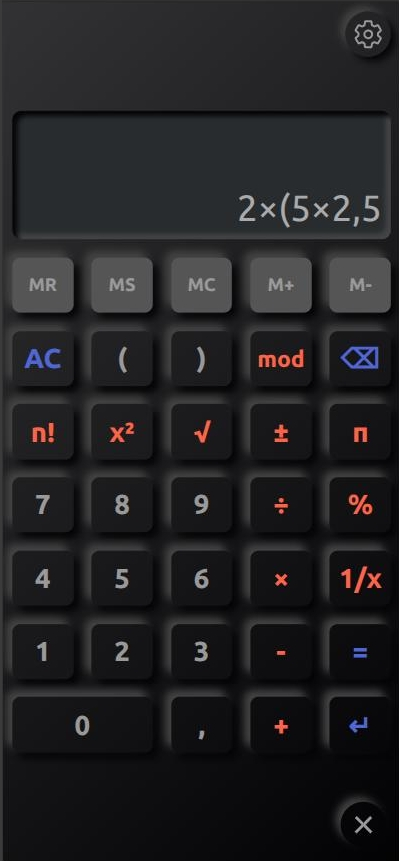
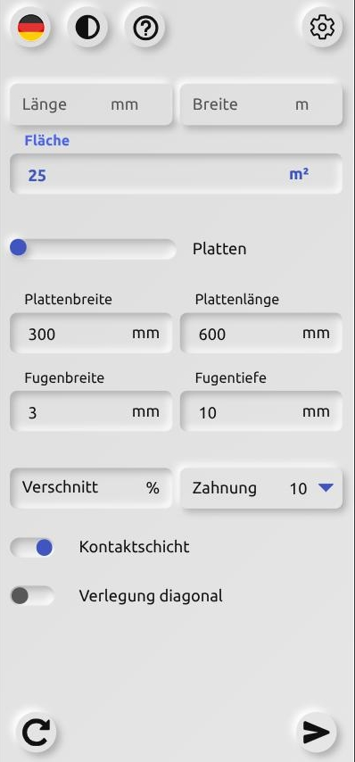
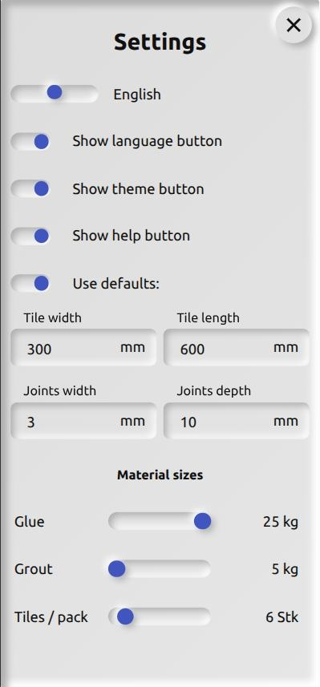

# PWA - Material calculation for tilers (multi lingual)

## Content
  * [Brief](#brief)
  * [Features](#features)
  * [How to Use](#how-to-use)
  * [Change Log](#change-log)
  * [ToDo](#todo)  
  * [Screenshots](#screenshots)

## Brief 
  This Progressive Web App (PWA) allows you to calculate all the materials required for tiling. Simply enter the area to be laid, set the appropriate parameters (size of the notched trowel, contact layer, tile and joint sizes) - and you're done!
  You can also calculate the quantities required for levelling surfaces or producing screed.
  The app has an integrated calculator that makes it easy to calculate partial areas and accept the result.
  Dark and light modes are available, and the style of the calculator can also be customised.
  The app supports five different languages:
  - german
  - italian
  - english
  - portuguese
  - romanian

## Features
  * calculating of required tiles, glue and grout
  * calculating of levelling compound or screed
  * runs on all platforms (iOS or Android)
  * integrated calculator for calculating partial areas "on the fly"
  * dark and light mode available

## How to use
  Simply copy the link and open the page in your browser.

  [https://materialcalculator.jom-soft.com/index.html](#https://materialcalculator.jom-soft.com/index.html)

  Then following these steps:
  * iOS:
    - go to the bottom menu of the Safari browser
    - push up the menu and select "add to home screen"
    - confirm the message

  * Android:
    - go to the triple dot menu of the Chrome browser on the upper right corner
    - select "add to home screen"
    - confirm

  The new app icon will occur on your home screen now.

  > [!NOTE] 
  > The app is designed mainly for mobile devices. On desktop or tablets the layout may be corrupted.
  > Some click events do not work (yet). In the future a full support for all devices is planned.

## Change Log
  * V0.0.1
    - first experimental version
  * V1.0.0
    - first stable version
  * V1.3.0
    - revisited and refractored version, fixed some minor bugs
  * V1.3.1
    - style anhancements
    - fixed a bug in the calculator

## ToDo
  - implementation of desktop and tablet support
  - displaying a slider to change tile-package sizes in the result window
  - adding a "flat" style for the calculator

## Screenshots

Required input fields are displayed in red color. The send button is disabled as long as not all required fields are filled out.
You can either input the values for the length and width in the named fields, or by clicking on the area field the input will switch to direct area input.
In this case a calculator icon will be shown on the right side. Now you also have got access to the integrated calculator in order to calculate the area. By clicking the <kbd> ↵</kbd>  key of the calculator, the value is taken over to the area field.

If either the length or width field get the focus, a ruler icon occurs on the right side. By clicking it you can toggle the gauge units.

Note the calculator icon on the right side of the area field. 
> [!NOTE]
> The length and width fields are disabled when the area field is active. They can be switched on again simply by clicking them.

As soon as you click on the <kbd> send</kbd> button, the result is displayed in a new window:

The integrated calculator also allows term calculations to add up partial areas.

The app also provides a light mode and 5 different languages.

